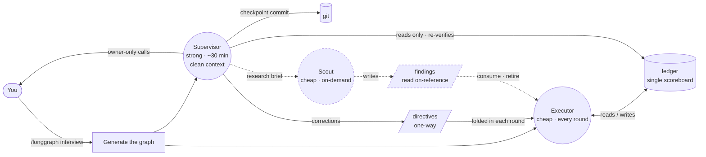

<div align="center">

# loop-graph

**Run a long coding task as a small graph of agent nodes, not one drifting loop.**

A Codex / [Claude Code](https://claude.com/claude-code) / Grok Build–oriented skill that turns *"make this production-ready"* into an executor node that does the work and a supervisor node that watches from outside the executor's context and corrects drift before it compounds.

loop-graph is **graph engineering** made concrete — the shift from tuning a single agent loop to wiring specialized agent roles into a graph. Two roles today; more planned.

[](../../LICENSE)
[](../../CONTRIBUTING.md)


English · [简体中文](README.zh-CN.md)

</div>

---

## The problem

Hand an agent a large, vague goal — *"get this repo to production quality"*, *"push accuracy above baseline"*, *"finish the migration"* — and over dozens of rounds it drifts:

- scope creep: new abstractions, v2 endpoints, config nobody asked for;
- fake "done": tests with no production call site, features that compile but do nothing;
- a quietly lowered bar: a frozen contract changed, a metric regressed;
- a lost thread: no single source of truth, so round 30 contradicts round 5.

The agent cannot catch this in itself: it reasons from the same history that produced the drift, so it will report itself on-spec. You end up reviewing every round by hand.

## From loop engineering to graph engineering

Loop engineering tries to fix this inside the loop — better prompts, more reminders, a bigger context window. It plateaus, because the loop's own history is what corrupts its judgment.

Graph engineering moves the structure outside the model: a small graph of specialized agent roles with separate contexts, connected only by durable, inspectable state. loop-graph applies this to one scenario — long-horizon coding — with the smallest useful graph:

- **Executor** — does the work, one item per round, against a single ledger.
- **Supervisor** — starts from a clean context on every tick and audits the run like an outside reviewer at acceptance: it **re-runs the gates itself** and inspects the real diff against the acceptance criteria and the repo's own standards (`AGENTS.md`/`CLAUDE.md`, `ops.md`), so it catches the drift, fake-done, and undisclosed shortcuts the executor cannot see in the context where the corner was cut — then commits what passes, decides pending items, and adjusts the plan through the one-way directives edge.

The graph is designed to grow beyond these two roles — see the [roadmap](#roadmap-more-node-roles).

The nodes communicate only through inspectable state — a ledger, a git tree, a one-way directives file — so the discipline is enforced by the wiring:

- **One scoreboard.** `ledger.md` is the single source of truth. When code, docs and ledger disagree, the ledger is fixed first.
- **Bounded live files.** The ledger keeps current state and only the latest rounds; `directives.md` keeps fixed-at-generation policy subjects and a capped queue of unconsumed corrections. Rotation is keyed to a cap that is always reached — rounds past the keep-window, corrections at or below the folded watermark — and every live file has a hard line cap, so no edge can grow until a node truncates its read and misses the newest entry. Cold history lands in `archive/`, which normal nodes never read.
- **One item per round**, verified the same round, then logged. No batching, no deferred testing.
- **Forced convergence, tracked in the ledger.** A convergence round — no new features, net lines ≤ 0 — fires on whichever comes first: every Nth round (default 5) or once accumulated net lines cross the cap (default 400). The trigger is an explicit flag in the scoreboard, not a modulo the stateless loop must recompute, so it can't be silently skipped — and the supervisor audits that it happened.
- **Register-then-defer.** Gaps found mid-round are logged, not silently patched or ignored.
- **Blocked is not stopped.** An owner decision, a missing input, a milestone under audit — none of them ends the activation. The executor records the blocker and takes the next *already-registered* item whose write set is disjoint from the blocked surface, the audit surface, and every other item taken this way; the supervisor audits that lane separately, so it can neither blur nor delay milestone promotion.
- **Red lines that halt the run.** No unauthorized push, no destructive git on others' work, no secrets in commits, frozen contracts stay frozen, metrics never regress.
- **Independent acceptance audit.** The supervisor re-verifies claimed-done work from its clean context — re-running the gates and checking the real diff against the acceptance bar and the shared standards (`ops.md`, `AGENTS.md`/`CLAUDE.md`) — and corrects drift, fake-done, wasteful method, or a stale plan only through the directives file. It never edits the ledger and never shares the executor's context. It commits what passes and decides by default; only a short owner-only list escalates to you.
- **Pre-adjudicated authority.** Owner-only decisions on the goal's critical path (e.g. dropping dead tables when the goal *is* slimming the schema) are settled up front in the interview into a **standing authorization** — an objective evidence bar the loop acts under autonomously — so the run executes its own work instead of stalling on "proposals awaiting sign-off". Only genuinely case-by-case calls escalate to you.
- **Owner choices, not owner homework.** A genuine escalation arrives in plain
  language with a recommended option and at most three outcomes; the owner can
  reply `A`, `B`, or `C` without reconstructing the implementation.

No LangGraph, no Python runtime, no orchestration server: the nodes and edges are Markdown files any coding agent can follow.

## How it works



Solid edges are the core graph: the executor works against the ledger; the supervisor watches from outside, commits clean checkpoints, and injects corrections through the one-way directives edge. The two never share a context and never write the same file. The dashed **scout** is an optional node — added only when research needs to happen off the critical path — writing to its own findings edge (see the [roadmap](#roadmap-more-node-roles)).

## One strong model, cheap execution

Because the nodes share no context, each can run on a different model. The discipline is what makes a cheap executor safe: its scope is capped at one item per round, the rules live in the ledger and directives rather than in its context, and a stronger model reviews the result.

| Node | Runs | Model | Why |
| --- | --- | --- | --- |
| Authoring (`/longgraph` interview) | once | your best model | designing gates, red lines and milestones is the judgment call |
| Executor | every round | a cheap / fast agent — a budget tier, a local model, an OSS coder | it follows an explicit ledger one step at a time |
| Supervisor | every ~30 min | a strong model | judging a run from a cold read is the hardest call, but it fires rarely |

The executor prompt is plain Markdown pointing at plain Markdown — paste it into whichever agent is cheapest. The expensive reasoning is concentrated in authoring and the occasional audit, not spent on every round.

## Hosts and the loop

A *node* is a role — executor, supervisor. A *host* repeatedly invokes it. A node never relies on chat memory between iterations — the ledger is the memory — so a dropped session resumes with nothing lost.

- **The ledger is a live file, not host text.** Hand the loop a thin pointer at the run files; it re-reads them each round — never fold the ledger into the host's own prompt text, where it goes stale. A host's progress UI *mirrors* the ledger; it never replaces it, and the ledger wins every conflict.
- **The supervisor runs outside the executor's context.** A host may use a separate schedule, cron tick, or a fresh audit subagent created by an independent harness; it never audits from inside the executor's loop.

**Each node runs on its own timer and never wakes the other.** The executor fires, closes several verified rounds on warm context, ends; the supervisor fires on a slower cadence, audits, appends corrections, ends. A correction is folded on the executor's next fire. There is no dispatch, no resume prompt and no liveness protocol — so a tick with nothing to say is a complete tick, not a missed heartbeat, and an unreachable peer costs one interval rather than the run.

Hosts also differ in **what a fire starts from**, and that drives what a run costs. Almost none boots cold — most resume the previous fire — so finer rounds are *not* cheaper, and batching several rounds into one warm fire is. `/longgraph` reads only the selected file under [`references/`](references/) to size the cadence and the rounds-per-fire batch.

Each loop **stops its own timer** when the run is done. Exact launch and stop behavior comes from the selected host reference.

## Quickstart

1. **Install** the longgraph library (this skill ships inside it):

   ```bash
   curl -fsSL https://raw.githubusercontent.com/levi-qiao/longgraph-skill/main/install.sh | sh
   ```

   <sub>Symlinks `/longgraph` for Codex / Cursor (legacy `/octopus` too). Claude Code uses the plugin.</sub>

2. **Run `/longgraph` in Codex, Claude Code, or Grok Build.** It detects the current host and inspects the workspace first, then asks one short batch only for unresolved owner decisions. The files land in a fresh `.longgraph/<date-slug>/` directory. ([What each file does →](#files-generated-per-run)) For unused / duplicate / slim work, invoke [`/loop-converge`](../loop-converge/README.md) instead — same compile path, pre-bound North Star.

3. **Choose A to create both nodes here (recommended), or B for prompts only.** On A, Codex, Claude Code, or Grok Build creates and verifies the executor and supervisor directly; it does not ask you to identify the current client or open the sessions yourself.

4. **Leave the reported runtime nodes active.** They stop themselves at terminal state using the detected host's mechanism.

On **Cursor** or **shell/cron**, choose prompts-only and use the matching [host reference](references/). On Grok Build, A is two `/loop` scheduler tasks.

## Repository layout

These files are read, not edited:

| Path | What it is |
| --- | --- |
| [`SKILL.md`](SKILL.md) | The skill entry: the interview and generation flow behind `/longgraph`. |
| [`templates/`](templates/) | Node and edge templates the skill fills in per run; usable by hand outside Claude Code. |
| [`methodology`](../../lib/methodology.md) | The rationale: each rule and the failure mode it prevents. |
| [`examples/self-iteration-longgraph-skill/`](examples/self-iteration-longgraph-skill/) | **Public Git evidence** — this skill’s own multi-day hardening window (commit-backed; not a private client run). |
| [`examples/redacted-multiday-control-plane/`](examples/redacted-multiday-control-plane/) | **Redacted real-run pattern** — multi-day control-plane functions only (ledger, clean-context audit, gates, blocked-work lane, owner cards); no private payload. |
| [`examples/add-tests-to-cli/`](examples/add-tests-to-cli/) | A worked *fictional* run — executor and ledger three rounds in. Start here for ledger shape. |
| [`examples/migrate-blob-storage/`](examples/migrate-blob-storage/) | A longer *fictional* worked run — milestones, a pilot-before-cohort backfill, a convergence round, a supervisor directive catching self-reported evidence, and the non-skippable milestone gate in action. |
| [Public / private boundary](../../docs/public-private-boundary.md) | What may enter the public tree vs stay project-local. |

## Files generated per run

Each run gets a fresh `.longgraph/<date-slug>/` in your repo:

| File | Written by | Role |
| --- | --- | --- |
| `executor.md` | generated once | The executor prompt — the loop's thin pointer target. Encodes the loop's self-stop. |
| `ledger.md` | the executor, every round | Single source of truth: goals, gates, convergence tracker, round log, open gaps. Read this to follow the run. |
| `directives.md` | the supervisor; owner if unsupervised | Bounded one-way queue: current STANDING policy + unconsumed corrections. The designated writer rotates folded entries. |
| `ops.md` | generated once; author/owner updates in place | Current environment, build and data facts; runtime nodes read it as ambient context. |
| `supervisor.md` | generated once | The supervisor prompt; the selected host reference defines scheduling and self-stop. |
| `archive/*.md` | the writer of the corresponding live edge | Cold history for folded directives and old rounds; normal nodes never read them. |

## When to use it

Use it when the task spans many rounds, success is verifiable (tests, gates, metrics) and drift is a real risk. Skip it for one-shot edits, or for work where every step needs a human to judge success.

## FAQ

**Why a graph and not "a loop with a monitor"?** The load-bearing property is that the supervisor is a separate node with its own clean context, connected to the executor only by inspectable edges. That separation — not the schedule — is what lets it catch drift the executor can't. Multi-agent frameworks model runs as graphs for the same reason; loop-graph does it with Markdown instead of a runtime.

**Does it require one particular host?** No. The nodes and edges are plain Markdown. Author the graph once, then use one isolated reference per selected host; mixed-host runs are supported.

**Isn't a fixed 5th-round convergence arbitrary?** It's a default, and it isn't purely fixed: convergence fires on whichever comes first — N rounds *or* accumulated net lines over the cap — so a bloat-heavy stretch converges sooner and a quiet one doesn't waste a round. Both bounds are tuned to the plan at generation. It's also tracked as an explicit flag in the ledger (not a modulo the loop recomputes), so it actually triggers. What matters is that a forcing function exists and reliably fires, not the exact number.

**Can a node commit or push on its own?** Only if you authorize it in the interview. The safe default: the executor implements and verifies, commits are a separate authorized step (often the supervisor's), and push is never automatic.

## Roadmap: more node roles

Executor plus supervisor is the smallest useful graph, not the whole idea. The optional scout already handles bounded research off the critical path. Possible future roles include a red-team reviewer for "done" claims and a test oracle that owns the gates. Each role remains one Markdown node plus one inspectable edge.

## Contributing

Issues and PRs welcome — see [CONTRIBUTING.md](../../CONTRIBUTING.md).

## License

[MIT](../../LICENSE) © 2026 levi-qiao
