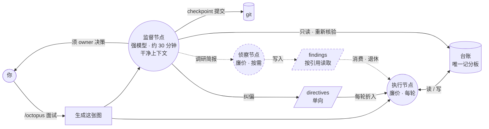

<div align="center">

# loop-graph

**把长周期编码任务跑成一张智能体节点图，而不是一个会漂移的循环。**

一个面向 Codex / [Claude Code](https://claude.com/claude-code) 的技能：把"让这个项目达到生产标准"这类模糊目标，拆成一个干活的执行节点和一个站在执行方上下文之外的监督节点，在漂移累积之前纠偏。

loop-graph 是 **graph engineering（图工程）** 的一次具体落地——从调教单个智能体循环，转向把分工明确的智能体角色接成一张图。目前是两个角色，后续会增加。

[](../../LICENSE)
[](../../CONTRIBUTING.md)


[English](README.md) · 简体中文

</div>

---

## 问题

给智能体一个又大又模糊的目标——"把这个仓库做到生产质量""把精度提到基线以上""完成迁移"——跑上几十轮它就开始漂移：

- 范围蔓延：没人要的新抽象、v2 端点、"灵活"配置；
- 假装完成：没有生产调用面的测试、能编译却什么也不做的功能；
- 悄悄降标：改了冻结契约、让指标回退；
- 丢失主线：没有唯一真相，第 30 轮和第 5 轮自相矛盾。

智能体自己发现不了这些：它推理所依据的历史，正是产生漂移的那段历史，所以它会报告自己"仍在规格内"。结果还是要人逐轮盯。

## 从 loop engineering 到 graph engineering

Loop engineering 试图在循环内部解决——更好的提示词、更多提醒、更大的上下文窗口。它有天花板，因为腐蚀循环判断力的正是它自己的历史。

Graph engineering 把结构移到模型之外：一张由分工明确、上下文彼此隔离的智能体角色组成的小图，只通过持久、可检视的状态相连。loop-graph 把它落在"长周期编码"这一个场景上，从最小可用的图起步：

- **执行节点**——干活，一轮只做一项，对着唯一台账推进。
- **监督节点**——每个 tick 从干净上下文启动，像验收时的外部评审一样审计这次运行：它**自己重跑门禁**、对照验收标准和仓库自己的规范（`AGENTS.md`/`CLAUDE.md`、`ops.md`）检查真实 diff，抓出执行方在抄近路的那段上下文里看不到的漂移、假完成和未申报的偷工——然后提交通过的部分、裁决 pending 项、并通过单向 directives 边调整计划。

这张图会长出更多角色——见[路线图](#路线图更多节点角色)。

节点之间只通过可检视的状态通信——一份台账、一棵 git 树、一个单向 directives 文件——纪律由接线保证：

- **唯一记分板。** `ledger.md` 是唯一真相。代码、文档、台账冲突时，先修台账。
- **热文件有界。** ledger 只保留当前状态和最近轮次；`directives.md` 只保留生成时固定的策略主题与有上限的未消费纠偏队列。已折叠指令和旧轮次按每 100 个 ID 分片进入 `archive/`，正常节点从不读取。
- **一轮只做一项**，当轮验证，再记入台账。不批处理，不延后测试。
- **强制收敛，写进台账里。** 收敛轮（零新功能、净行数 ≤ 0）在两个条件谁先到就触发：距上次收敛满 N 轮（默认 5）**或**累计净增行数越过上限（默认 400）。触发条件是记分板里一个显式标志位，而不是无状态循环每轮要自己重算的取模，所以不会被悄悄跳过——监督节点还会审计它到底有没有真收敛。
- **发现即登记。** 中途发现的缺口一律登记，不静默修、不忽略。
- **门禁等待期也做有效工作，但必须预先冻结。** 生成时可以预置单轮 backlog；它的精确写集和依赖必须与受审里程碑、下一里程碑、共享/全局表面及其他 backlog 项完全解耦。执行节点在 `pending-audit` 期间每轮最多做一项，监督节点单独验收，因此不会模糊或拖延里程碑裁决。
- **红线即停。** 未授权不 push、不对他人改动做破坏性 git、密钥不入提交、冻结契约保持冻结、指标不回退。
- **独立验收审计。** 监督节点在干净上下文里重新验收执行方声称已完成的活——自己重跑门禁、对照验收标准和共享规范（`ops.md`、`AGENTS.md`/`CLAUDE.md`）核对真实 diff——纠正漂移、假完成、低效方法或过时的计划，只通过 directives 文件下达，不编辑台账，也不共享执行方的上下文。它提交通过的部分、默认自行裁决，只有一小份 owner-only 清单会升级到你。
- **预置裁决授权。** 处在目标关键路径上的 owner-only 决策（比如目标本身就是瘦身 schema，那每轮都会碰到删表），要在访谈阶段就先和 owner 敲定成一条**常驻授权（standing authorization）**——给出一条客观、可核验的证据门槛，循环在满足门槛时自主执行（owner 事后复核），而不是把自己该干的活降级成「提案待签核」然后卡住。只有真正需要逐案判断、无法预先写成门槛的决策才升级给你。
- **给 owner 选择题，不给思考题。** 真正需要升级时，用通俗语言说清问题，
  给出推荐项和最多三个结果；owner 只需回复 `A`、`B` 或 `C`，不必重建项目上下文。

没有 LangGraph、没有 Python 运行时、没有编排服务：节点和边就是任何编码智能体都能执行的 Markdown 文件。

## 工作原理



实线是核心图：执行节点对着台账推进；监督节点从外部审视、提交干净的 checkpoint、经单向 directives 边注入纠偏。两者不共享上下文，也不写同一个文件。虚线的**侦察节点**是可选的——只在调研需要脱离关键路径时加入——写自己独立的 findings 边（见[路线图](#路线图更多节点角色)）。

## 一个强模型，廉价地执行

因为节点不共享上下文，每个节点可以跑在不同的模型上。纪律本身让廉价执行方变得安全：范围锁死在一轮一项，规则写在台账和 directives 里而非它的上下文里，还有强模型复核结果。

| 节点 | 频率 | 模型 | 原因 |
| --- | --- | --- | --- |
| 搭图（`/octopus` 面试） | 一次 | 你最强的模型 | 设计门禁、红线、里程碑靠判断力 |
| 执行节点 | 每轮 | 廉价/快的 agent——低价档、本地模型、开源 coder | 它只是照显式台账一步步走 |
| 监督节点 | 每 ~30 分钟 | 强模型 | 冷读判漂移最难，但触发频率低 |

执行方的提示词是指向纯 Markdown 的纯 Markdown，粘进哪家便宜的 agent 都行。贵的推理集中在搭图和偶尔的巡检，不花在每一轮上。

## host 与 loop

*node* 是角色——执行节点、监督节点。*host* 负责反复唤起它。node 不依赖会话记忆——台账就是记忆——所以中断后也能续跑。

- **ledger 是实时文件，不是宿主提示词的一部分。** loop 只拿到指向 run 文件的短提示，每轮重新读取；宿主的进度 UI 只能镜像 ledger，冲突时以 ledger 为准。
- **监督节点运行在执行者上下文之外。** 宿主可以使用独立排期、cron tick，或由独立调度壳每次新建一个审计 subagent；监督者绝不在执行者 loop 内审计。

host 分自适应和定间隔两种节奏：前者一轮结束就继续，后者按“一轮工作 + 门禁”的时长设定间隔。

host 还有一个差别决定了一个 run 到底烧多少 token：**下一轮从什么上下文开始**。几乎没有 host 是冷启动，多数都接着上一轮往下跑——所以**轮切得越细并不越省**。`/octopus` 只读取 [`references/`](references/) 中选定宿主的文件，用它确定轮次粒度与重置点。

所有定时 loop 在跑完时都会**自己停下**。具体启动、唤醒和停止动作来自选中的宿主 reference；`/octopus` 会直接给出下一步和可复制提示词。

## 快速开始

1. **安装** octopus 库（本技能包含在内）：

   ```bash
   curl -fsSL https://raw.githubusercontent.com/levi-qiao/octopus-skill/main/install.sh | sh
   ```

   <sub>装成单一 `/octopus` 技能，Claude Code 和 Codex 都可用。</sub>

2. **在 Codex 或 Claude Code 中运行 `/octopus`。** 它先识别当前宿主并检查工作区，只把无法推断的 owner 决策合成一小组问题。文件生成到全新的 `.octopus/<日期-slug>/` 目录。（[每个文件的作用 →](#每次-run-生成的文件)）

3. **选择 A 直接在这里创建两个节点（推荐），或选择 B 只拿提示词。** 选 A 后，Codex 或 Claude Code 会直接创建并验证执行者和监督者，不再问你当前是什么客户端，也不用你手动新开会话。

4. **保留结果中列出的运行节点。** 到终态时，它们会使用识别到的宿主机制自行停止。

在其他宿主上选择 prompts-only；模板也可以手动使用。

## 仓库结构

这些文件只读、不用改：

| 路径 | 说明 |
| --- | --- |
| [`SKILL.md`](SKILL.md) | 技能入口：`/octopus` 背后的面试与生成流程。 |
| [`templates/`](templates/) | 节点与边的模板，技能按 run 填充；脱离 Claude Code 也可手动使用。 |
| [`methodology`](../../lib/methodology.md) | 设计依据：每条规则及其防范的失败模式。 |
| [`examples/add-tests-to-cli/`](examples/add-tests-to-cli/) | 一次完整的样例 run——executor 与台账跑到第 3 轮的样子。建议先读。 |
| [`examples/migrate-blob-storage/`](examples/migrate-blob-storage/) | 更长的样例 run——里程碑、先试点再全量的回填、一次收敛轮、一条识破"自报证据"的监督指令，以及不可跳过的里程碑门禁实际运作过程。 |

## 每次 run 生成的文件

每次 run 在你的仓库里生成一个 `.octopus/<日期-slug>/`：

| 文件 | 谁写 | 作用 |
| --- | --- | --- |
| `executor.md` | 生成一次 | 执行节点的提示词——loop 瘦指针指向它。内含 loop 的自停逻辑。 |
| `ledger.md` | 执行节点，每轮 | 唯一真相：目标、门禁、每轮日志、未决缺口及预置的 Gate-wait backlog。看它跟进度。 |
| `directives.md` | 监督节点；无监督者时为 owner | 有界单向队列：当前 STANDING 策略 + 未消费纠偏；由指定写者轮转已折叠条目。 |
| `ops.md` | 生成一次；author/owner 原位更新 | 当前环境、构建、数据事实；运行节点只把它作为 ambient context 读取。 |
| `supervisor.md` | 生成一次 | 监督节点的提示词；排期与自停由选中的宿主 reference 定义。 |
| `archive/*.md` | 对应 live edge 的写者 | 已折叠指令和旧轮次的冷历史分片，每 100 个 ID 一份；正常节点不读取。 |

## 适用场景

任务跨很多轮、成功可验证（测试、门禁、指标）、且确有漂移风险时用它。一次性小改，或每一步都需要人判断成败的工作，不必用。

## 常见问题

**为什么是"图"，不是"带监控的循环"？** 关键性质在于：监督方是一个拥有独立干净上下文的节点，只经可检视的边与执行方相连。是这层隔离——而非定时调度——让它能抓到执行方抓不到的漂移。多智能体框架把运行建模成图也是同一个原因；loop-graph 用 Markdown 而非运行时实现了它。

**必须配某个特定宿主吗？** 不需要。节点与边都是纯 Markdown；搭图后只加载所选宿主的独立 reference，也支持混合宿主运行。

**固定第 5 轮收敛会不会太武断？** 它是默认值，而且并非纯固定：收敛在"满 N 轮"或"累计净增越过上限"两者谁先到时触发——所以猛涨的一段会更早收敛，安静的一段也不会白白浪费一轮。两个上限都在生成时按 plan 调。它还是台账里一个显式标志位（不是循环每轮自己重算的取模），所以真的会触发。重要的是存在强制收敛机制、且能可靠触发，而非具体数字。

**节点能自己 commit / push 吗？** 仅当你在面试里授权。安全默认：执行方只实现和验证，提交是单独的授权步骤（常由监督节点执行），push 永不自动。

## 路线图：更多节点角色

执行 + 监督只是最小可用的图；可选的侦察节点已经负责关键路径外的有界调研。未来可以增加核查"已完成"断言的红队评审，或独占门禁的测试裁判。每个角色仍只是一份 Markdown 节点加一条可检视的边。

## 贡献

欢迎 Issue 与 PR，见 [CONTRIBUTING.md](../../CONTRIBUTING.md)。

## 许可证

[MIT](../../LICENSE) © 2026 levi-qiao
