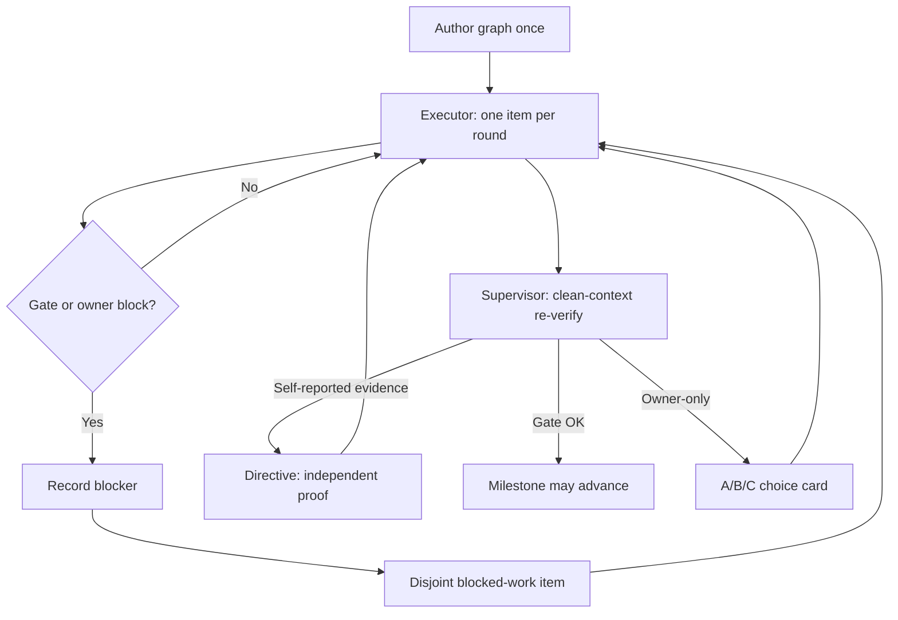

# Example: multi-day control-plane pattern (redacted real-run)

A **function-only, public-safe** case. It describes what the loop-graph *does* over
multi-day agent work — durable scoreboard, clean-context audit, gates, blocked-work
lanes, owner choice cards — without publishing any private run payload.

**Evidence class:** redacted real-run pattern (control-plane only).

This is **not** public Git telemetry (see
[self-iteration](../self-iteration-octopus-skill/)), and **not** a full fictional
ledger (see [migrate-blob-storage](../migrate-blob-storage/)). Readers cannot
re-run a private project to verify scale; re-check is *structural consistency*
with the public methodology plus the evidence boundary below.

## Generalized setting (no private mapping)

Label only: **long-horizon quality-eval engineering** — improving a measurable
pipeline over many agent rounds while a human owner keeps red lines and
promotion authority.

No product name, customer, corpus, scorecard body, or internal service appears
here. Any resemblance to a specific engagement is unintentional; the published
claims are **control-plane verbs and coarse scale only**.

## Coarse scale (buckets only)

| Signal | Public claim |
| --- | --- |
| Calendar span | **Multi-day** wall-clock (more than one workday; less than a marketing “200 continuous hours” story) |
| Round volume | **Tens of rounds** on a single durable ledger |
| Steering volume | **Many** supervisor directives folded over the life of the run |
| Shape | Multiple milestones with **non-skippable** promotion gates |
| Continuity | Progress lived in run files under a dated `.octopus/` directory, not in chat memory |

These are **order-of-magnitude buckets**, not measurements. They do **not** equal
continuous model execution hours or unattended production autonomy.

## What the graph did (functions)

### 1. Single scoreboard across days

The executor worked **one ledger item per round**, verified in the same round,
and wrote the result to `ledger.md`. After context compaction or a new session,
the next fire re-read the ledger and continued from the smallest unclosed item —
no transcript export required.

### 2. Clean-context supervisor overturned self-reported “done”

A supervisor node ran on its **own timer** and **own context**. It re-checked
acceptance against real artifacts and the written gates — not the executor’s
narration. When the executor treated self-generated counters or “looks green”
as proof, the supervisor issued a **one-way directive**: produce independent
evidence or reopen the claim. The executor never shared the supervisor’s context;
the supervisor never edited the ledger.

### 3. Non-skippable milestone gates

When a milestone entered `pending-audit`, ordinary work that touched the audit
surface waited. Advancement required a supervisor verdict (or an explicit owner
path). The gate could not be blurred by “we’re mostly done.”

### 4. Blocked ≠ stopped (gate-wait / blocked-work lane)

While a gate or owner decision blocked the critical path, the executor took
**already-registered** items whose write sets were **disjoint** from the blocked
and audit surfaces. Useful progress continued without smuggling changes into the
thing under review. The supervisor audited that lane separately so a side-lane
failure could not silently hold or poison a valid promotion.

### 5. Owner A/B/C cards, not owner homework

Truly owner-only calls (destructive cutovers, lowering a gate, policy calls that
cannot be pre-authorized as standing rules) arrived as short **recommended
A/B/C** choices. The loop did not dump a research paper into the owner’s chat.

### 6. Forced convergence and bounded live history

Growth was periodically forced to stop and simplify. Live ledger / directives
sections stayed **capped**; older rounds and folded corrections moved to cold
archive so hot-path reads could not grow without bound and silently drop the
newest signal.

### 7. Register-then-defer

Gaps found mid-round were **logged**, not silently fixed “while we were there”
and not ignored. They re-entered the queue as ordinary items later.

## Optional timeline (function labels only)

## What this case deliberately does *not* claim

- Continuous multi-day LLM runtime without human steering
- A production autopilot, orchestration server, or new runtime kernel
- Any **accuracy / recall / scorecard / audit-report** substance
- Any private repository, product, customer, or absolute path
- Public Git re-checkability of the private engagement (that is a different
  evidence class — use [self-iteration](../self-iteration-octopus-skill/) for Git)

## Evidence boundary

**Allowed here**

- Control-plane function names already in public methodology (`ledger`, gates,
  clean-context supervisor, blocked-work lane, owner cards, convergence)
- Coarse scale buckets (multi-day, tens of rounds, many directives)
- Links to public templates, methodology, and other public examples
- Explicit redaction status and re-check limits

**Forbidden here (and not present)**

- Private workspace roots, product codenames, service/repo names from sensitive work
- Live or archived private `.octopus/` contents, directives text, ops env facts
- Audit-report bodies, findings, recommendations, or excerpts
- Real corpus metrics, document samples, or identifying score tables
- Absolute home paths, internal hostnames, credentials, session transcripts
- Exact private milestone titles, task IDs, or fingerprintable internal labels

If a fact cannot be stated without risk of de-anonymizing a private engagement,
it is **omitted** — not “approximated” from private logs.

## How a reader should re-check

1. Confirm this page stays within the [public / private boundary](../../../../docs/public-private-boundary.md).
2. Confirm every function named here also appears in
   [methodology](../../../../lib/methodology.md) and the fictional full run
   [migrate-blob-storage](../migrate-blob-storage/) (shape teaching without secrets).
3. Do **not** expect a public command that reconstructs a private run.

## Related

- [Self-iteration (public Git)](../self-iteration-octopus-skill/README.md) — checkable product history
- [migrate-blob-storage](../migrate-blob-storage/) — synthetic multi-milestone ledger
- Root [Evidence](../../../../README.md#evidence)
