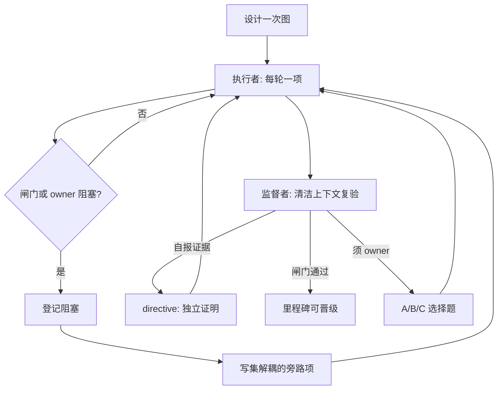

# 示例：多日控制面模式（脱敏真实 run）

这是一条 **只写功能、可公开发布** 的案例。它说明 loop-graph 在多日 agent 工作里
*做什么*——持久记分牌、清洁上下文审计、闸门、阻塞旁路、owner 选择题——**不**发布任何
私有 run 载荷。

**证据类型：** 脱敏真实 run 模式（仅控制面）。

这不是公开 Git 遥测（见
[自迭代](../self-iteration-longgraph-skill/README.zh-CN.md)），也不是完整虚构 ledger
（见 [migrate-blob-storage](../migrate-blob-storage/)）。读者无法用公开命令复现私有
项目的规模；可复检的是：与公开方法论结构一致，以及下方证据边界成立。

## 泛化场景（不映射任何私有项目）

仅用标签：**长周期质量评估工程**——在多轮 agent 推进中改进可度量流水线，同时由
人类 owner 保留红线与晋级权。

此处不出现产品名、客户、语料、记分卡正文或内部服务。若与某次真实工作“像”，纯属
巧合；公开主张只有 **控制面动词 + 粗粒度量级**。

## 粗粒度规模（只用桶，不用精确表）

| 信号 | 公开主张 |
| --- | --- |
| 日历跨度 | **多日** wall-clock（超过一个工作日；不是“连续 200 小时自治”话术） |
| 轮次体量 | 单一持久 ledger 上 **数十轮** 量级 |
| 纠偏体量 | 全生命周期内 **多条** 监督者 directives 被折叠 |
| 形状 | 多个带 **不可跳过** 晋级闸门的里程碑 |
| 连续性 | 进度在带日期的 `.longgraph/` 运行文件里，不在聊天记忆里 |

以上是 **数量级桶**，不是测量值。它们 **不等于** 连续模型执行小时，也不等于无人
值守生产自治。

## 图做了什么（功能）

### 1. 跨日唯一记分牌

执行者 **每轮只做一个** ledger 条目，同轮验证，写入 `ledger.md`。上下文压缩或新
会话后，下一次 fire 重读 ledger，从最小未关闭项继续——不必导出聊天记录。

### 2. 清洁上下文监督者推翻“自报完成”

监督者节点跑在 **自己的定时器** 与 **自己的上下文** 上。它对照真实产物与成文闸门
复验，而不是听执行者叙事。当执行者把自产计数或“看起来绿了”当证据时，监督者发
出 **单向 directive**：补独立证据或重开主张。执行者不共享监督者上下文；监督者不
改 ledger。

### 3. 不可跳过的里程碑闸门

里程碑进入 `pending-audit` 后，触及审计面的普通工作等待。晋级需要监督者裁决（或
明确的 owner 路径）。不能用“差不多完成了”模糊闸门。

### 4. 阻塞 ≠ 停机（gate-wait / 阻塞旁路）

闸门或 owner 决策挡住关键路径时，执行者只取 **已登记**、写集与阻塞面/审计面
**完全解耦** 的条目。有用进度继续，但不把改动偷运进受审对象。监督者单独审计该
旁路，侧道失败不能悄悄拖死或污染合法晋级。

### 5. Owner 的 A/B/C 卡，不是作业

真正只能由 owner 决定的事项（破坏性切换、降低闸门、无法预置成常驻授权的政策）
以简短 **推荐 A/B/C** 出现。循环不把研究报告堆进 owner 聊天。

### 6. 强制收敛与有界热历史

定期停止膨胀、做减法。热 ledger / directives 段有 **上限**；更旧轮次与已折叠纠
偏进冷归档，避免热路径无限涨并在截断读时丢掉最新信号。

### 7. 发现即登记、延后处理

中途发现的缺口 **登记入册**，既不“顺便修掉”也不默默忽略；稍后作为普通条目再
入队。

## 可选时间线（仅功能标签）

## 本案明确不主张什么

- 连续多日、无人干预的 LLM 运行
- 生产自动驾驶、编排服务或新 runtime kernel
- 任何 **准确率 / 召回 / 记分卡 / 审计报告** 正文
- 任何私有仓库、产品、客户或绝对路径
- 对私有项目的公开 Git 复算（那是另一类证据——Git 请看
  [自迭代](../self-iteration-longgraph-skill/README.zh-CN.md)）

## 证据边界

**此处允许**

- 公开方法论里已有的控制面功能名（ledger、闸门、清洁上下文监督、阻塞旁路、
  owner 卡、收敛）
- 粗粒度量级桶（多日、数十轮、多条 directives）
- 指向公开模板、方法论与其他公开示例的链接
- 明确的脱敏状态与复检限制

**此处禁止（且未写入）**

- 私有工作区根路径、敏感工作相关的产品/服务/仓库名
- 私有 `.longgraph/` 热/冷内容、directives 原文、ops 环境事实
- 审计报告正文、发现、建议或摘录
- 真实语料指标、文档样本或可识别的分数表
- 本机绝对路径、内网主机名、凭据、会话转录
- 精确的私有里程碑标题、任务 ID 或可指纹识别的内部标签

若某事实一说就会降低私有项目匿名性，则 **省略**——不从私有日志“近似改写”。

## 读者如何复检

1. 确认本页仍落在 [公开 / 私有边界](../../../../docs/public-private-boundary.md) 内。
2. 确认此处每个功能名也出现在
   [方法论](../../../../lib/methodology.md) 与虚构完整 run
   [migrate-blob-storage](../migrate-blob-storage/)（用无秘密的形态教学）。
3. **不要**期待一条公开命令能重建私有 run。

## 相关

- [自迭代（公开 Git）](../self-iteration-longgraph-skill/README.zh-CN.md)
- [migrate-blob-storage](../migrate-blob-storage/)
- 根目录 [证据](../../../../README.zh-CN.md#证据)
